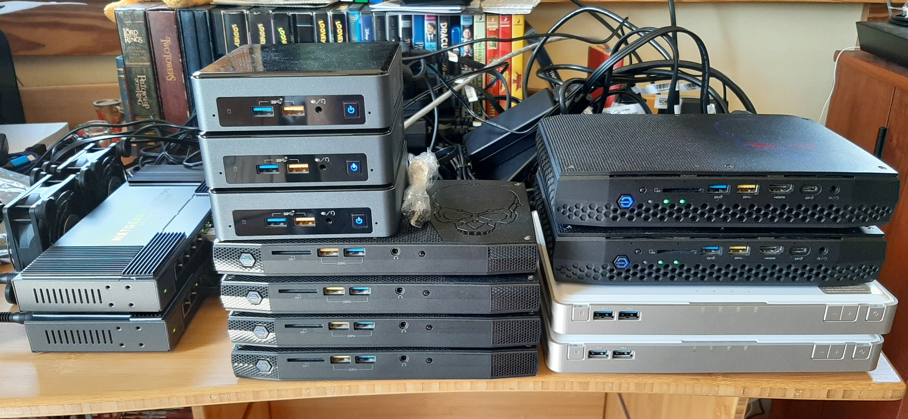
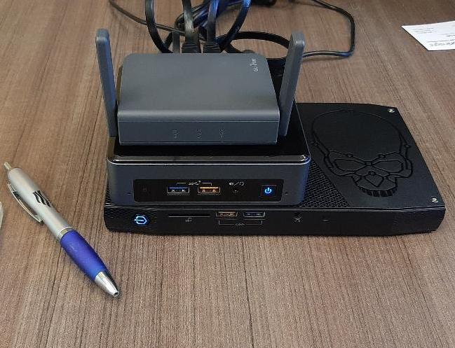

## Building an OpenShift - OKD 3.11 Lab, Soup to Nuts

This project is a tutorial that will lead you through setting up an OpenShift - OKD 3.11 cluster.  However, this tutorial will cover much more than just installing OKD 3.11.  We are going to install and configure all aspects of the infrastructure that your OKD cluster is going to run on.

By the end of this tutorial, you will have set up the following components:

* KVM - LibVirt install on base CentOS
* Control Plane server with:
    * Bind - DNS provider
    * Nginx web server hosting all the RPMS for your environment
    * Sonatype Nexus:
        * Maven Dependencies
        * Container Registry
     * Golang build environment
     * OpenShift - OKD 3.11 RPMs and Container Images built from source code
* Automated provisioning of Guest VMs for your OKD cluster
* Finally, at least one OKD cluster - depending on your available compute resources

### Equipment for your lab

You will need at least one physical server for your lab.  More is obviously better, but also more expensive.  I have built my lab around the small form-factor NUC systems that Intel builds.  My favorite is the [NUC6i7KYK](https://ark.intel.com/content/www/us/en/ark/products/89187/intel-nuc-kit-nuc6i7kyk.html).  This little guy is about the size of a VHS video tape, remember those...  Some of you don't... ;-)

The NUC6i7KYK sports a quad-core 6th Generation i7 processor.  It has 2 M.2 slots for SSD storage and will accept up to 64GB of DDR4 RAM in its 2 SODIMM slots.  It is marketed toward gamers, but makes a very compact and powerful server for your lab.

I am also a fan of the [NUC8i3BEK](https://ark.intel.com/content/www/us/en/ark/products/126149/intel-nuc-kit-nuc8i3bek.html).  This one is even smaller than the NUC6i7KYK.  It sports a dual-core CPU, supports 32GB of RAM and has a single M.2 slot for an SSD.  I use one of these for my [control plane](Control_Plane/README.md) server.

You will need a network switch.  I am using a couple of [Netgear GS110EMX](https://www.netgear.com/support/product/GS110EMX.aspx).  It's a great little managed switch with 8 1Gb ports and 2 10Gb ports.  The 10Gb ports are really handy if you also have a NAS device that supports 10Gb network speeds.  

You will also need a router.  Assuming that you already have a home router, you can use that.  However, if you want something portable and awesome, check out the GL.iNet [GL-AR750S-Ext](https://www.gl-inet.com/products/gl-ar750s/).  This little guy runs OpenWRT which means that you can use it as a router for your lab network, plus - Wireless bridge, VPN, PXE, Http, DNS, etc...  [OpenWRT](https://openwrt.org) is a very powerful networking distro.

Optional: NAS device.

I recently came across this little Frankenstein.  The QNAP NAS-Book [TBS-453DX](https://www.qnap.com/en-us/product/tbs-453dx).  This thing is not much bigger than the NUCi7KYK, (the VHS tape).  It has 4 M.2 slots for SSD storage and will serve as an iSCSI server, in addition to all of the other capabilities that QNAP markets it for.  The iSCSI server is what caught my eye!  This thing completes a mini-datacenter setup.  With this device added to my lab, I am able to replicate most of the capabilities that you will find in an enterprise datacenter.

My home lab has grown to be almost embarrassing...  but, what can I say, except that I have a VERY understanding wife.

For your own lab, I would recommend starting with the following:

* 1 x NUC8i3BEK - For your Control Plane and development server
    * 32GB RAM
    * 500GB M.2 SATA SSD
* 1 x NUC6i7KYK - For your Hypervisor
    * 64GB RAM
    * 1TB M.2 SATA SSD
* 1 x GL.iNet GL-AR750S-Ext - For your router

A minimal setup like this will cost a little less than a 13" MacBook Pro with 16GB of RAM.  For that outlay you get 6 CPU cores (12 virtual CPUs), 96GB of RAM, and a really cool travel router!

Check prices at [Amazon.com](https://www.amazon.com) and [B&H Photo Video](https://www.bhphotovideo.com).  I get most of my gear from those two outlets.

Once you have acquired the necessary gear, it's time to start setting it all up.

### Setting Up your Lab:

1. [Base OS Install](CentOS_Install.md)
1. [KVM Setup](KVM_Config.md)
1. [Control Plane Setup](Control_Plane/README.md)
1. [VM Guest Provisioning](Provision_Hosts/README.md)
1. [OpenShift build from source](OKD_Install/README.md)

### Additional Topics:

* [Nested virtualization](Provision_Hosts/Nested_KVM.md)
* [PXE Boot](PXE_Setup/README.md)
